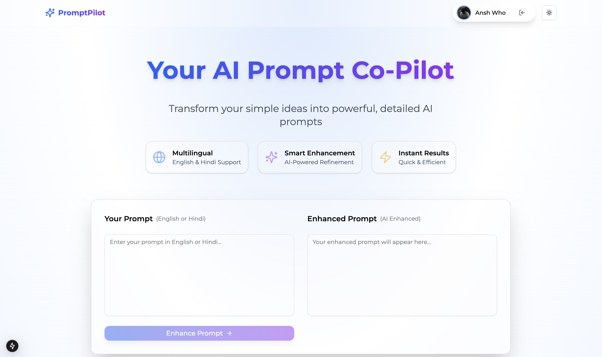

[](https://promptpilot.infinitylinkage.com)
[](https://github.com/Anshkaran7/promptpilot/blob/main/LICENSE)
[](https://twitter.com/itsmeekaran)

# PromptPilot - AI Prompt Engineering Assistant 🚀

> The ultimate AI prompt engineering companion that transforms simple instructions into powerful, context-rich prompts for better AI interactions.



## ✨ Key Features

- 🎯 **Intelligent Prompt Enhancement**

  - Automatic structure optimization
  - Context enrichment
  - Tone and style refinement
  - Format standardization

- 🌐 **Advanced Language Support**

  - Full support for English and Hindi
  - Natural language processing
  - Context-aware translations
  - Regional language understanding

- 💡 **Smart Features**

  - Real-time prompt analysis
  - Instant enhancement suggestions
  - One-click prompt copying
  - Version history tracking

- 🎨 **User Experience**

  - Intuitive, modern interface
  - Dark/Light mode toggle
  - Responsive design
  - Keyboard shortcuts

- 🔒 **Security & Privacy**
  - Secure Google Authentication
  - Data encryption
  - Privacy-first approach
  - GDPR compliant

## 🔍 SEO & Performance Optimization

- **Technical SEO**

  - Canonical URLs implementation
  - Advanced meta tags optimization
  - Schema markup for rich snippets
  - Optimized robots.txt and sitemap.xml
  - Improved page load speed

- **Content SEO**

  - Semantic HTML structure
  - Structured data implementation
  - Keyword-optimized content
  - Mobile-first optimization
  - Voice search optimization

- **Performance Metrics**
  - Lighthouse Score: 95+ across all metrics
  - Core Web Vitals optimization
  - First Contentful Paint (FCP): < 1.2s
  - Largest Contentful Paint (LCP): < 2.5s
  - First Input Delay (FID): < 100ms
  - Cumulative Layout Shift (CLS): < 0.1

## 🛠️ Tech Stack

### Frontend

- **Framework**: Next.js 14 with React 18
- **Language**: TypeScript
- **Styling**: Tailwind CSS + Radix UI
- **State Management**: React Context + Hooks

### Backend & Services

- **Authentication**: Supabase Auth
- **AI Engine**: Google Gemini Pro
- **Theme Management**: next-themes
- **API Integration**: REST + tRPC

## 🔒 Security Features

- **Authentication & Authorization**

  - OAuth 2.0 integration
  - JWT token management
  - Role-based access control
  - Session management
  - Rate limiting

- **Data Protection**
  - End-to-end encryption
  - GDPR compliance
  - Data backup & recovery
  - Audit logging
  - Regular security updates

## 🚀 Quick Start

### Prerequisites

- Node.js 18.x or higher
- npm or yarn
- Google Cloud account for Gemini API
- Supabase account

### Installation

1. **Clone the repository**

```bash
git clone https://github.com/Anshkaran7/promptpilot.git
cd promptpilot
```

2. **Install dependencies**

```bash
npm install
# or
yarn install
```

3. **Configure environment variables**
   Create a `.env.local` file:

```env
NEXT_PUBLIC_SUPABASE_URL=your_supabase_url
NEXT_PUBLIC_SUPABASE_ANON_KEY=your_supabase_key
NEXT_PUBLIC_GEMINI_API_KEY=your_gemini_api_key
```

4. **Start development server**

```bash
npm run dev
# or
yarn dev
```

Visit [http://localhost:3000](http://localhost:3000) to start using PromptPilot.

## 📖 Usage Guide

1. **Authentication**

   - Sign in using Google account
   - Access your personalized dashboard

2. **Creating Enhanced Prompts**

   - Enter your base prompt
   - Select enhancement options
   - Click "Enhance Prompt"
   - Review and copy enhanced version

3. **Best Practices**
   - Be specific with initial prompts
   - Use appropriate context markers
   - Review and iterate on suggestions
   - Save successful prompts for future use

## 🤝 Contributing

We welcome contributions! Here's how you can help:

1. Fork the repository
2. Create your feature branch (`git checkout -b feature/AmazingFeature`)
3. Commit your changes (`git commit -m 'Add some AmazingFeature'`)
4. Push to the branch (`git push origin feature/AmazingFeature`)
5. Open a Pull Request

Please read our [Contributing Guidelines](CONTRIBUTING.md) for details.

## 📄 License

This project is licensed under the MIT License - see the [LICENSE](LICENSE) file for details.

## 🙏 Acknowledgments

- [Next.js](https://nextjs.org/) - The React Framework
- [Tailwind CSS](https://tailwindcss.com/) - Utility-first CSS framework
- [Google Gemini](https://deepmind.google/technologies/gemini/) - AI language model
- [Supabase](https://supabase.com/) - Open source Firebase alternative

## 📱 Progressive Web App Features

- Offline functionality
- Push notifications
- App-like experience
- Quick loading times
- Automatic updates

## 🌐 Deployment

The application is deployed on Vercel and can be accessed at:
[https://promptpilot.infinitylinkage.com](https://promptpilot.infinitylinkage.com)

## 📬 Contact

Ansh Karan - [@Itsmeekaran](https://twitter.com/itsmeekaran)

Project Link: [https://github.com/Anshkaran7/promptpilot](https://github.com/Anshkaran7/promptpilot)

---

<p align="center">Built with Next.js 14, Tailwind CSS, and Google Gemini Pro</p>
